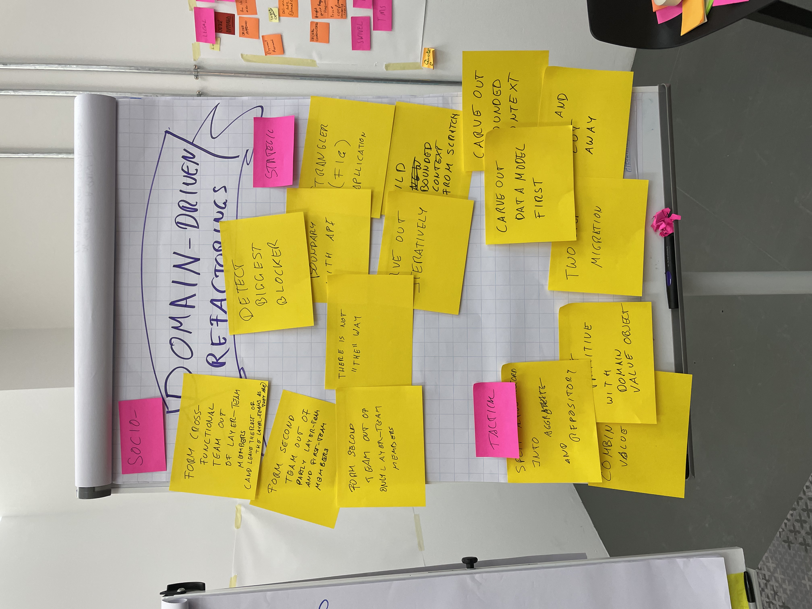

# Domain-Driven Refactorings

In [@Fowler2019] many standard refactorings are described; [@Kerievsky20XX] shows how to refactor the patterns from [@Gamma1995].
On this page, I'm collecting refactorings that help to introduce patterns originally described in [@Evans2004].
The catalog is split into three categories:

- **Tactical Refactorings:** Change the inner implementation of a bounded context
- **Strategic Refactorings:** Help with splitting a monolith architecture into bounded contexts.
- **Socio-technical Refactorings:** Reorganize the teams. This is often enabled by and/or accompanying strategic refactorings.

In the descriptions I follow the classic Fowlerian format of Introduction/Motivation/Mechanics/Example(s).

## The (Currently Evolving) Catalog

### Strategic Refactorings

- [Carve Bounded Context out of Monolith](carve-bounded-context-out-of-monolith)
- Implement Bounded Context from Scratch (and Replace it in the Monolith)
- Carve Out Data Model First
- Carve Out Domain Model First

### Socio-technical Refactorings

- Form Cross-Functional Team out of Layer-Team Members
- Form Second Team out of Partly Layer-Team and First-Team Members
- Form Second Team out of Only Layer-Team Members

### Tactical Refactorings

- Enforce Ubiquitous Language
- Replace Primitive with Value Object (=> bei Fowler Replace Primitive with Object)
- Split Active Record into Aggregate and Repository
- Combine Value Objects
- Replace Collection of Entities with Entity in Its Own Right (=> there is a relationship to Encapsulate Collection)
- Replace Collection of Entities with Repository

## Acknowledgement

I thank the participants of the open space “Domain-Driven Refactorings” at [KanDDDinsky](https://kandddinsky.de/) 2021 conference.
